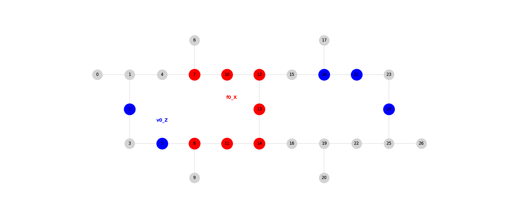
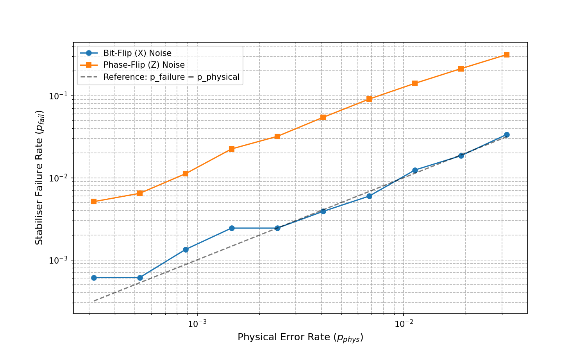

# Asymmetric Error Correction on a Heavy-Hexagonal Lattice

This repository contains a Python simulation built to explore a potential Honours project on quantum error correction. The simulation investigates the performance of topological stabilisers on a realistic 27-qubit heavy-hexagonal lattice under different noise channels, directly testing the hypothesis that this geometry offers asymmetric error protection.

## Key Features

* **Realistic Hardware Simulation:** Models the 27-qubit IBM Falcon r5 processor (`FakeMontrealV2`) with its heavy-hexagonal topology.
* **Stabiliser Implementation:** Implements both low-weight vertex (Z-type) and high-weight face (X-type) stabiliser measurement circuits.
* **Configurable Noise Models:** Introduces distinct, configurable noise models for bit-flip ($X$) and phase-flip ($Z$) errors using `qiskit-aer`.
* **Comprehensive Visualization:** Generates a suite of plots to visualize the hardware layout, the quantum circuits, and the final simulation results.
* **Reproducibility:** Includes a `Dockerfile` and `requirements.txt` to ensure the simulation can be run in a consistent environment.

## Visualizations

The script generates several plots to tell the full story of the experiment. The two key visualizations are:

1.  **The Hardware Layout:** This plot shows the 27-qubit lattice and highlights the specific vertex and face stabilisers investigated.
    

2.  **The Key Result:** This plot shows the performance of the X-type face stabiliser under different types of noise. The divergence of the two curves is the primary finding of this research.
    

## Getting Started

You can run this simulation either in a local Python environment or using Docker.

### 1. Local Python Environment (Recommended)

**Prerequisites:** Python 3.10+ and `pip`.

1.  **Clone the repository:**
    ```bash
    git clone https://github.com/SegusFaultise/heavy-hex-lattice-asymmetric-error-correction.git
    cd heavy-hex-lattice-asymmetric-error-correction
    ```

2.  **Create and activate a virtual environment:**
    ```bash
    python -m venv .venv
    source .venv/bin/activate
    ```

3.  **Install the dependencies:**
    ```bash
    pip install -r requirements.txt
    ```

### 2. Using Docker

**Prerequisites:** Docker installed and running.

1.  **Clone the repository** as shown above.

2.  **Build the Docker image:**
    ```bash
    docker build -t heavy-hex-lattice-asymmetric-error-correction .
    ```

## Usage

Once set up, running the simulation is straightforward.

### 1. Local Python Environment

Execute the main script. The simulation will run and save all plots to the `plots/` directory.
```bash
python main.py
```

### 2. Using Docker

Run the container using a volume mount to save the output plots to your local machine.
```bash
docker run --rm -v "$(pwd)/plots:/app/plots" heavy-hex-lattice-asymmetric-error-correction
```

## Results & Interpretation

The primary goal of this simulation was to test the hypothesis of asymmetric error protection. The results from the threshold analysis strongly support this hypothesis.

As shown in the plot, the X-type stabiliser (designed to detect Z-errors) is:
* **Highly sensitive to phase-flip (Z) noise**, with a failure rate that rises sharply with the physical error rate.
* **Extremely resilient to bit-flip (X) noise**, maintaining a very low failure rate across the tested range.

This significant difference in performance suggests that the heavy-hex code's geometry could be exploited for hardware with known, biased noise channels.

## Next Steps

This simulation provides a strong foundation for a full Honours project. The next logical stage of this research would be to expand this simulation from single stabiliser checks to a fully encoded logical qubit to measure the logical error rate and calculate a more precise error threshold.

## License

This project is licensed under the MIT License.
